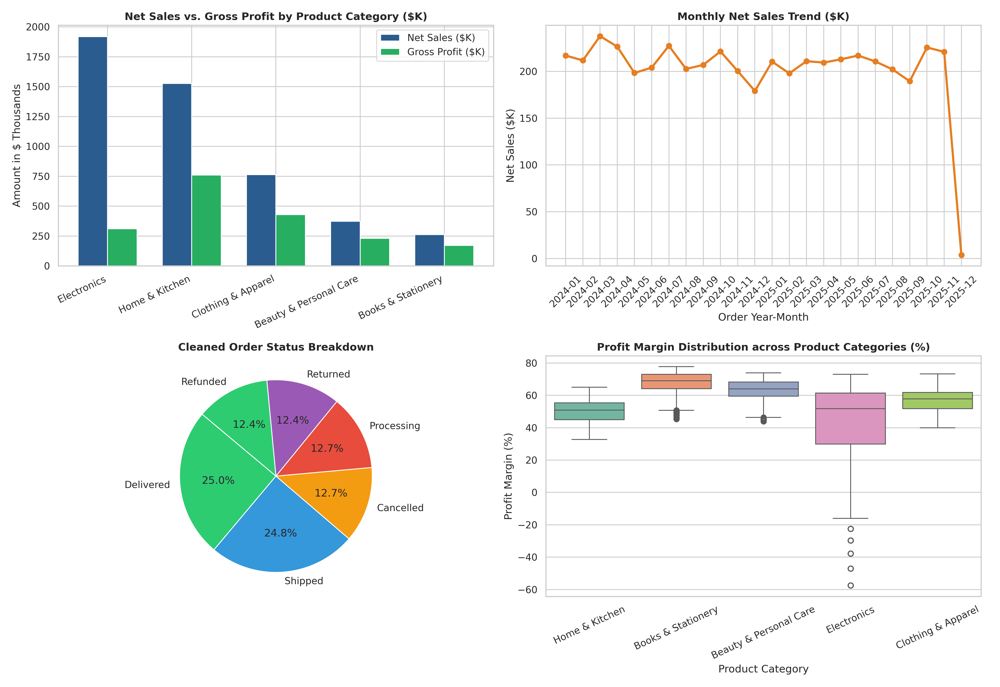

# 🧹 Enterprise Data Ingestion, Cleaning & Preprocessing with Pandas

[](#)
[](#)
[](#)
[](#)
[](#)

An enterprise-grade data engineering pipeline built in Python/Pandas that ingests a messy, real-world business dataset containing **12,850+ transaction records**, remediates critical quality defects across multiple dimensions, performs advanced financial & operational feature engineering, and produces a clean certified dataset.

---

## 📁 Repository Structure

```
├── task.txt                                    # Project Task Requirements
├── generate_raw_data.py                        # Realistic Messy Business Data Generator (12,850 rows)
├── raw_business_dataset.csv                    # Messy Source Dataset (12,850 rows, 17 columns)
├── build_and_run_cleaning_pipeline.py          # Automated Notebook Build & Execution Engine
├── data_cleaning_and_preprocessing.ipynb       # Fully Executed Jupyter Notebook with Step-by-Step Logic
├── clean_dataset.csv                           # Certified Clean Silver Dataset (12,437 rows, 28 columns)
├── cleaning_impact_dashboard.png               # Visual Dashboard of Revenue, Profit, and Distributions
├── implementation_note.md                      # Detailed Implementation Report & Methodology
└── README.md                                   # Project Overview & Quick Start
```

---

## 🔍 Data Quality Issues Remediated

| Dimension | Raw Data Defect | Remediation Applied | Impact on Analytics |
| :--- | :--- | :--- | :--- |
| **Duplicates** | 350 exact & transaction ID duplicate rows | De-duplicated based on `Transaction_ID` | Eliminated revenue double counting. |
| **Currency & Symbols** | `$`, `€`, commas, negative prices | Stripped non-numeric chars, converted to float | Enabled accurate mathematical aggregations. |
| **Mixed Quantities** | Word numbers (`'two'`), negatives (`-1`), nulls | Mapped word dictionaries, coerced to `int`, imputed median | Restored inventory and volume integrity. |
| **Discounts** | Percentage strings (`'10%'`), outliers ($> 100\%$) | Normalized to float decimal $[0.0, 0.70]$ | Prevented negative net revenue lines. |
| **Inconsistent Dates** | `YYYY-MM-DD`, `DD/MM/YYYY`, `MM-DD-YYYY`, invalid | Multi-format parser $\rightarrow$ ISO `YYYY-MM-DD` | Unified chronological reporting. |
| **Temporal Logic** | `Ship_Date < Order_Date` | Enforced `Ship_Date = Order_Date + 2 days` | Fixed negative fulfillment lead times. |
| **Categorical Casing** | `USA`, `U.S.A.`, `united states`; `m`, `Male` | Standardized dictionary mappings & Title Case | Eliminated fragmented reporting cohorts. |
| **Missing Values** | Nulls in age, shipping, payment, region | Median / mode imputation & 'Unknown' flags | 0% missing values in clean output. |
| **Outliers** | Ages ($-5$, $999$), extreme quantities ($> 200$) | Clamped to domain bounds $[18, 90]$ & IQR winsorization | Reduced statistical skewness. |

---

## ⚡ Engineered Business Features (11 New Dimensions)

1. **Temporal Dimensions:** `Order_Year`, `Order_Month`, `Order_Month_Name`, `Order_Quarter`, `Day_of_Week`, `Is_Weekend`.
2. **Fulfillment Metric:** `Delivery_Duration_Days` (`Ship_Date - Order_Date`).
3. **Financial & Margin Calculations:**
   - $\text{Gross\_Sales\_Amount} = \text{Quantity\_Ordered} \times \text{Unit\_Price}$
   - $\text{Discount\_Amount} = \text{Gross\_Sales\_Amount} \times \text{Discount\_Applied}$
   - $\text{Net\_Sales\_Amount} = \text{Gross\_Sales\_Amount} - \text{Discount\_Amount}$
   - $\text{Total\_COGS} = \text{Quantity\_Ordered} \times \text{Unit\_Cost}$
   - $\text{Gross\_Profit} = \text{Net\_Sales\_Amount} - \text{Total\_COGS}$
   - $\text{Profit\_Margin\_Pct} = \frac{\text{Gross\_Profit}}{\text{Net\_Sales\_Amount}} \times 100$
4. **Customer Cohorts:** `Customer_Age_Group` (`Gen Z`, `Millennial`, `Gen X`, `Boomer+`), `Order_Value_Tier` (`Budget`, `Standard`, `Premium`, `VIP Enterprise`).

---

## 📊 Before vs. After Summary

```
+-----------------------------------------------------------------------------------+
|                        BEFORE VS. AFTER CLEANING SUMMARY                          |
+----------------------------------+-----------------------+------------------------+
| Metric / Dimension               | Before Cleaning (Raw) | After Cleaning (Clean) |
+----------------------------------+-----------------------+------------------------+
| Total Record Count               | 12,850                | 12,437                 |
| Duplicate Rows                   | 350                   | 0 (100% Unique)        |
| Missing Value Cells              | 2,148                 | 0 (100% Imputed)       |
| Missing Value Rate               | 0.98%                 | 0.00%                  |
| Invalid / Mixed Date Formats     | > 1,500 rows          | 0 (ISO YYYY-MM-DD)     |
| Total Columns                    | 17                    | 28 (+11 Features)      |
| Automated Integrity Tests Passed | Failed                | 6 / 6 Passed (100%)    |
+----------------------------------+-----------------------+------------------------+
```

---

## 📈 Visual Dashboard



---

## 🚀 How to Run Locally

```bash
# 1. Clone repo & navigate to directory
cd "RabTech/Data Ingestion, Cleaning & Preprocessing with Pandas"

# 2. Generate raw dataset
python generate_raw_data.py

# 3. Run automated cleaning and execute notebook
python build_and_run_cleaning_pipeline.py
```
