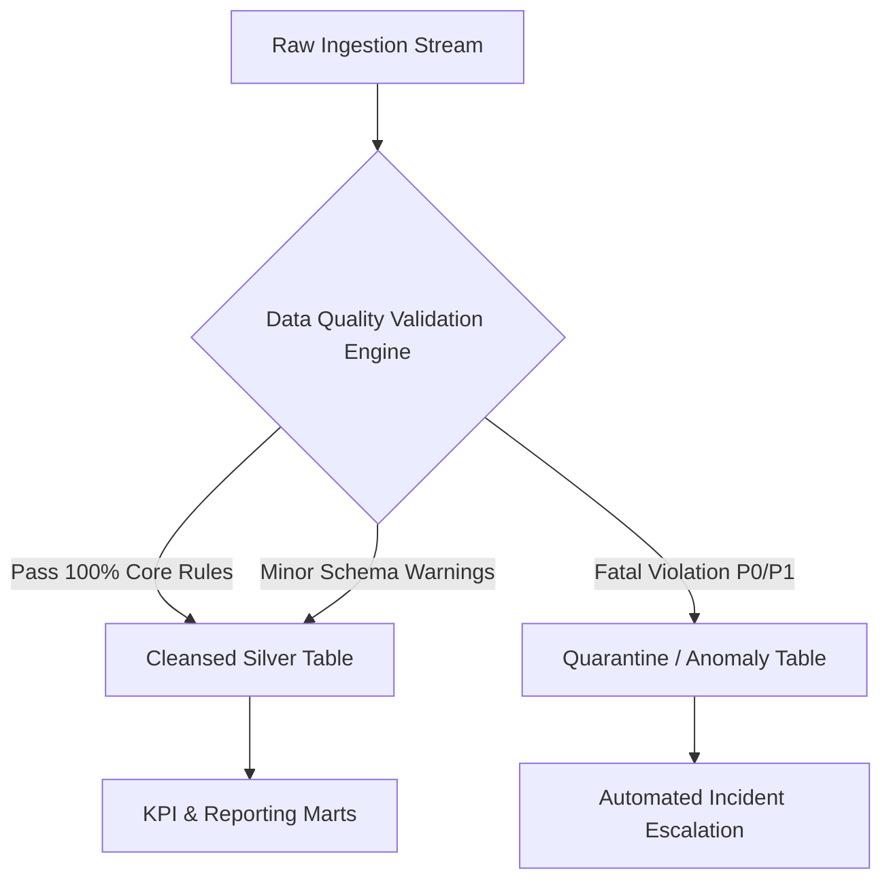

# Data Quality Contract: RabTech Ed-Commerce Orders Data

**Document Version:** 1.0.0  
**Effective Date:** 2026-01-01  
**Dataset Identifier:** `rabtech.commerce.retail_orders`  
**Storage Format / Layer:** Raw Landing (Bronze) -> Cleansed Core (Silver) -> KPI Marts (Gold)  
**Primary Decision Owner:** VP of Growth & Commercial Operations  
**Technical Data Owner:** Lead Analytics & Data Platform Engineer  

---

## 1. Executive Summary & Purpose

This Data Quality Contract establishes a formal, testable agreement between **Upstream Data Producers** (Checkout Service, Payment Gateway Webhook, CRM/Order Management Systems) and **Downstream Data Consumers** (Financial Reporting, Growth Analytics, Leadership Dashboards, Machine Learning).

The objective is to guarantee the operational reliability, accuracy, and timeliness of core commercial transaction metrics (Gross Merchandise Value, Net Revenue, Payment Success Rate, Average Order Value, and Refund Rates) by enforcing strict quality thresholds, automated anomaly quarantining, and incident escalation protocols.

---

## 2. Stakeholder Governance Roster

| Role | Title / Team | Responsibility | Contact SLA |
| :--- | :--- | :--- | :--- |
| **Business Decision Owner** | VP of Growth & Commercial Ops | Defines KPI logic, business rules, revenue recognition policies | P0/P1 Escalations |
| **Data Consumer (Finance)** | Head of Financial Planning & Analysis | Signs off on revenue reconciliation, VAT/tax & refund tracking | Daily review |
| **Technical Owner (Data Platform)** | Lead Data Platform Engineer | Ingestion pipelines, pipeline orchestration, contract enforcement | Primary On-Call |
| **Data Producer (Engineering)** | Lead Platform & Checkout Engineer | Upstream schema compliance, webhook stability, payload validation | Upstream Bug Fixes |
| **Analytics Engineer** | Senior Analytics Engineer | dbt / Silver data modeling, KPI semantic layer, reporting marts | Metric Audits |

---

## 3. Dataset Schema & Column-Level Constraints

The `retail_orders` dataset captures granular customer purchase transactions across all product lines (Learning Kits, Course Access, Mentor Sessions).

| Column Name | Physical Data Type | Business Description | Nullable | Primary Constraints & Quality Rule | Anomaly Impact |
| :--- | :--- | :--- | :---: | :--- | :--- |
| `order_id` | `VARCHAR(64)` | Unique transaction identifier | **No (0%)** | Strict Primary Key, Regex `^RT-[0-9]{4,}$`, non-null, unique across platform history. | Double counting of revenue & volume |
| `order_date` | `DATE (ISO 8601)` | Order creation date | **No (0%)** | ISO Format `YYYY-MM-DD`, valid calendar date between `2025-01-01` and `CURRENT_DATE()`. | Trend distortions, pipeline crash |
| `customer_segment` | `VARCHAR(32)` | Customer demographic tier | **No (<1%)** | Restricted enum: `['Student', 'Fresher', 'Professional']`. Case-insensitive match normalized to Title Case. | Skewed cohort attribution |
| `city` | `VARCHAR(64)` | Customer billing/shipping city | **No (<2%)** | Non-empty string, length >= 2, valid standard geographic city names. | Regional demand blindspots |
| `category` | `VARCHAR(64)` | Product family | **No (0%)** | Restricted catalog enum: `['Learning Kit', 'Course Access', 'Mentor Session']`. | Unassigned product revenue |
| `quantity` | `INTEGER` | Units purchased in order | **No (0%)** | Integer $> 0$ and $\le 50$. No string/word numbers (e.g. `'two'`), no negatives. | Negative GMV, calculation failure |
| `unit_price` | `DECIMAL(10,2)` | List price before discount (INR) | **No (0%)** | Numeric amount $> 0.00$. Must adhere to authorized catalog pricing (₹799, ₹999, ₹1499). | Revenue leakage, financial inaccuracy |
| `discount_pct` | `DECIMAL(5,2)` | Percentage discount applied | **Yes (Default 0)** | Range: $0.00 \le \text{discount\_pct} \le 100.00$. Missing values default to `0.00%` with audit warning. | Negative net revenue, pricing breach |
| `payment_status` | `VARCHAR(32)` | Final payment settlement state | **No (0%)** | Restricted enum: `['Paid', 'Pending', 'Failed', 'Refunded']`. Normalized to Title Case. | Inaccurate payment success & revenue |

---

## 4. The 5 Core Dimensions of Data Quality Verification



### Dimension 1: Completeness
- **Standard:** All mandatory business keys and dates must be 100% non-null.
- **Rules:**
  - `order_id`: $0\%$ missing.
  - `order_date`: $0\%$ missing.
  - `city`: $< 2\%$ missing allowed in raw; impute to `'Unknown'` in Silver and raise P2 warning.
  - `discount_pct`: missing values converted to `0.0%` with log tag `IMPUTED_DISCOUNT_ZERO`.

### Dimension 2: Uniqueness
- **Standard:** Primary key `order_id` must have 100% uniqueness.
- **Rules:**
  - `COUNT(order_id) == COUNT(DISTINCT order_id)`.
  - In case of exact identical duplicates, ingest the first record and route duplicate row to quarantine with reason `DUPLICATE_ORDER_ID`.

### Dimension 3: Validity (Data Type, Format & Domain Ranges)
- **Standard:** Values must conform to strict data type definitions, mathematical ranges, and valid date domains.
- **Rules:**
  - `quantity`: Must cast to integer $> 0$. Negative units (e.g., `-1`) and non-numeric strings (e.g., `'two'`) are quarantined with `INVALID_QUANTITY`.
  - `discount_pct`: Values $> 100\%$ (e.g., `105%`) or $< 0\%$ quarantined with `INVALID_DISCOUNT_RANGE`.
  - `order_date`: Non-standard date formats (e.g., `03/01/2026`) must be parsed; invalid calendar dates (e.g. `2026-13-10` with invalid month 13) quarantined with `INVALID_CALENDAR_DATE`.

### Dimension 4: Consistency & Standardization
- **Standard:** Case variations and whitespace anomalies across categorical dimensions must be reconciled.
- **Rules:**
  - `customer_segment`: Normalized via `INITCAP(TRIM(customer_segment))` -> `['Student', 'Fresher', 'Professional']`.
  - `payment_status`: Normalized via `INITCAP(TRIM(payment_status))` -> `['Paid', 'Pending', 'Failed', 'Refunded']`.
  - Cross-field logic: Orders with `unit_price <= 0` or price incompatible with product catalog flagged for review.

### Dimension 5: Freshness & Timeliness
- **Standard:** Transaction events must be ingested into Silver within 2 hours of checkout completion.
- **Rules:**
  - Daily pipeline execution SLA: 06:00 UTC daily.
  - Maximum allowable ingestion lag: 4 hours from transaction timestamp.

---

## 5. Enterprise KPI Definitions Governed by this Contract

| KPI ID | KPI Name | Mathematical Formula | Grain | Target Benchmark | Business Owner |
| :--- | :--- | :--- | :--- | :--- | :--- |
| **KPI-001** | **Gross Merchandise Value (GMV)** | $\sum (\text{quantity} \times \text{unit\_price})$ for non-failed orders | Daily / Category | $\ge ₹150,000 / \text{mo}$ | VP of Growth |
| **KPI-002** | **Net Realized Revenue** | $\sum (\text{quantity} \times \text{unit\_price} \times (1 - \frac{\text{discount\_pct}}{100}))$ for Paid orders | Daily / Segment | $\ge 85\%$ of GMV | Head of Finance |
| **KPI-003** | **Gross Order Volume** | $\text{COUNT(DISTINCT } \text{order\_id})$ | Daily / Platform | $\ge 50 \text{ orders/day}$ | Product Ops Manager |
| **KPI-004** | **Net Completed Orders** | $\text{COUNT(DISTINCT } \text{order\_id}) \text{ WHERE payment\_status = 'Paid'}$ | Daily / Segment | $\ge 80\%$ of Gross Orders | Head of Commercial Ops |
| **KPI-005** | **Payment Success Rate (PSR)** | $\frac{\text{Count of Paid Orders}}{\text{Total Orders Attempted}} \times 100\%$ | 15-min / Gateway | $\ge 85.0\%$ | Fintech & Payments Lead |
| **KPI-006** | **Average Order Value (AOV)** | $\frac{\text{Net Realized Revenue}}{\text{Net Completed Orders}}$ | Daily / Segment | $\ge ₹1,200$ | VP of Growth |
| **KPI-007** | **Discount Depth Rate** | $\frac{\text{Total Discount Concession Amount}}{\text{Gross Value of Discounted Orders}} \times 100\%$ | Weekly / Category | $\le 12.0\%$ | Marketing Director |
| **KPI-008** | **Refund Rate** | $\frac{\text{Count of Refunded Orders}}{\text{Count of Paid + Refunded Orders}} \times 100\%$ | Monthly / Product | $\le 5.0\%$ | Customer Experience Lead |
| **KPI-009** | **Category Revenue Share** | $\frac{\text{Category Net Revenue}}{\text{Total Platform Net Revenue}} \times 100\%$ | Monthly / Category | Kits 35%, Courses 45%, Mentorship 20% | Head of Product Portfolio |
| **KPI-010** | **Segment Monetization Share** | $\frac{\text{Segment Net Revenue}}{\text{Total Net Revenue}} \times 100\%$ | Monthly / Cohort | Professional $\ge 45\%$ | VP of Acquisition |

---

## 6. Incident Severity & Escalation SLA Matrix

When automated data quality checks fail, the system triggers alerts based on the following classification matrix:

```
+-----------------------------------------------------------------------------------+
|                           SEVERITY & ESCALATION MATRIX                             |
+----------+----------------------------------+-------------+-----------------------+
| Severity | Failure Criteria                 | SLA Ack/Fix | Escalation Channel    |
+----------+----------------------------------+-------------+-----------------------+
| P0       | Duplicate PKs, missing batch     | Ack: 15 min | PagerDuty On-Call,    |
| Critical | dates > 5%, revenue table drop   | Fix: 2 hrs  | #data-critical Slack, |
|          |                                  |             | SMS to VP of Eng      |
+----------+----------------------------------+-------------+-----------------------+
| P1       | Out-of-bounds discount/quantity, | Ack: 1 hr   | Jira High-Pri Incident|
| Major    | PSR < 75%, invalid enums > 5%    | Fix: 6 hrs  | #data-quality-alerts  |
+----------+----------------------------------+-------------+-----------------------+
| P2       | Casing mismatch, null non-crit   | Ack: 4 hrs  | #data-eng-backlog     |
| Minor    | city < 2%, schema doc deprecation| Fix: 24 hrs | Weekly Quality Review |
+----------+----------------------------------+-------------+-----------------------+
```

### Automated Remediation & Quarantine Protocol
1. **Quarantine Pipeline:** Records with P0/P1 invalidity (e.g. invalid month `2026-13-10`, negative quantity `-1`, discount $> 100\%$, missing date) are routed immediately to `quarantine_records` table with:
   - `quarantine_id`: Unique UUID
   - `source_record`: Full raw payload string
   - `failure_rule`: Triggered constraint rule name
   - `quarantined_at`: UTC timestamp
   - `remediation_status`: `PENDING_REVIEW`
2. **Circuit Breaker:** If $> 10\%$ of incoming batch records fail validity checks, the ingestion pipeline halts to protect downstream reporting marts.
3. **Escalation Notification:** Automated payload sent to `#data-quality-alerts` webhook with error breakdown and direct link to quarantined records.

---

## 7. Change Management & Contract Evolution

1. **Schema Changes:** Any change to upstream columns (type alterations, column deletions, rename) requires a minimum of **14 calendar days advance notice** and a version bump in this contract.
2. **Backward Compatibility:** Upstream services must produce backward-compatible payloads during transition periods.
3. **Contract Audits:** Bi-weekly data quality review meeting between Data Platform, Engineering, and Business Decision Owners to inspect quarantine logs and refine quality rules.

---

## 8. Formal Sign-off & Approvals

| Stakeholder Name | Title | Status | Approval Date |
| :--- | :--- | :---: | :--- |
| **Dr. Rajesh Sharma** | VP of Growth & Commercial Operations | **Approved** | 2026-01-02 |
| **Pooja Iyer** | Head of Financial Planning & Analysis | **Approved** | 2026-01-02 |
| **Vikram Malhotra** | Lead Data Platform Architect | **Approved** | 2026-01-03 |
| **Ananya Sen** | Lead Platform Checkout Engineer | **Approved** | 2026-01-03 |
